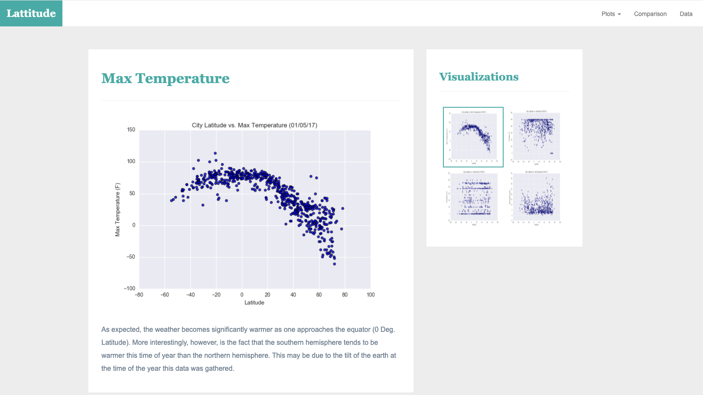

# Web-Design-Challenge

For this project, a visualization dashboard website was created using visualizations created in a previous assignment concerning weather data.  

<h1>Included in the website are:</h1>

<strong>A landing page containing:</strong> 
<ul>
  <li>An explanation of the project.</li>
  <li>Links to each visualizations page, with a sidebar containing preview images of each plot and link that takes user to that visualization.</li>
</ul>

<strong>Four visualization pages, each with:</strong> 
<ul>
  <li>A descriptive title and heading tag.</li>
  <li>The plot/visualization itself for the selected comparison.</li>
  <li>A paragraph describing the plot and its significance.</li>
</ul>

<strong>A "Comparisons" page that:</strong>
<ul>
  <li>Contains all of the visualizations on the same page for easy comparison.</li>
  <li>Uses a Bootstrap grid for the visualizations.</li>
  <li></li>
</ul>

<strong>A "Data" page that:</strong>
<ul>
  <li>Displays a responsive table containing the data used in the visualizations. </li>
  <li>Contains data from a .csv file as HTML, converted to HTML.</li>
</ul>

 

